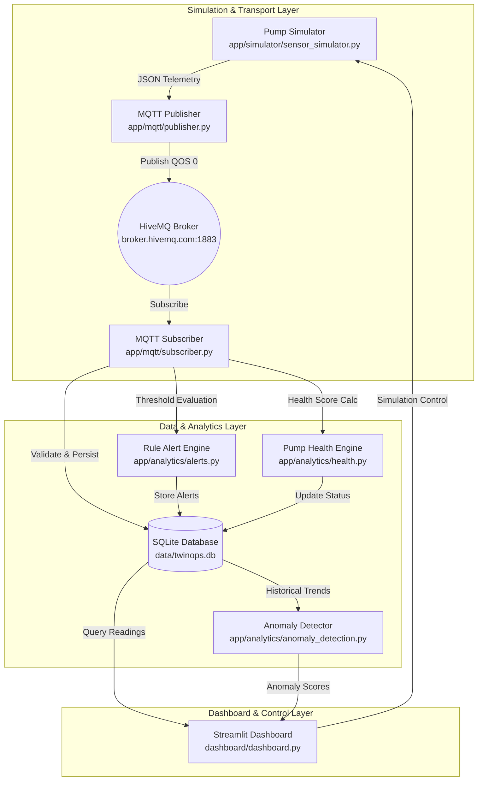

# Twin Ops — Industrial Digital Twin & Predictive Maintenance Platform


---

## 📌 Executive Summary & Purpose

**Twin Ops** is an end-to-end college capstone project demonstrating an **Industrial Digital Twin and Predictive Maintenance Platform** for an industrial water pump (`PUMP_001`).

The system integrates real-time IoT sensor simulation, MQTT message queuing, SQLite persistence, rule-based alert triggering, transparent health scoring, machine learning anomaly detection, and an interactive dark-themed industrial dashboard.

> [!IMPORTANT]
> **Academic Prototype Scoping**:
> This platform is a functional prototype built for academic demonstration. Health scores, anomaly scores, and maintenance recommendations are explicitly labeled as **Demonstration / Prototype Metrics** to distinguish experimental modeling from hardware-certified industrial failure prediction.

---

## 🏗️ System Architecture



---

## 📂 Project Structure

```text
Twin-Ops/
├── app/
│   ├── __init__.py
│   ├── config.py                  # Centralized thresholds & configuration
│   ├── simulator/
│   │   ├── __init__.py
│   │   └── sensor_simulator.py    # Stateful physical sensor simulator (NORMAL, WARNING, FAILURE, RANDOM)
│   ├── mqtt/
│   │   ├── __init__.py
│   │   ├── publisher.py           # Reconnecting MQTT telemetry publisher
│   │   └── subscriber.py          # Validating MQTT subscriber & ingestion pipeline
│   ├── database/
│   │   ├── __init__.py
│   │   ├── database.py           # SQLite connection management & parameterized SQL
│   │   └── models.py             # Data models & dataclasses
│   ├── analytics/
│   │   ├── __init__.py
│   │   ├── health.py             # Transparent Prototype Health Score (0-100)
│   │   ├── alerts.py             # Threshold rule engine
│   │   └── anomaly_detection.py   # IsolationForest / Z-score Anomaly Detector
│   └── utils/
│       ├── __init__.py
│       └── logging_config.py     # Structured logging setup
├── dashboard/
│   ├── dashboard.py              # Main Streamlit industrial dashboard
│   ├── components.py             # Digital Twin SVG schematic & metric cards
│   └── charts.py                 # Telemetry time-series charts
├── data/
│   └── twinops.db                # Persistent SQLite database
├── scripts/
│   └── view_database.py          # Terminal database inspector script
├── legacy/                       # Preserved initial code files
│   ├── Datarecive.py
│   ├── Datatransmit.py
│   ├── database_viewer.py
│   ├── main.py
│   └── sensorsimulator.py
├── tests/                        # Pytest automated test suite
│   ├── test_simulator.py
│   ├── test_database.py
│   ├── test_health.py
│   ├── test_alerts.py
│   └── test_anomaly.py
├── .env.example
├── .gitignore
├── requirements.txt
├── README.md
└── run.py                        # Unified CLI command runner
```

---

## ⚡ Installation & Setup

### 1. Clone & Navigate
```bash
git clone <repository_url>
cd "Twin Ops Project"
```

### 2. Create Virtual Environment

**macOS / Linux:**
```bash
python3 -m venv .venv
source .venv/bin/activate
```

**Windows (Command Prompt):**
```cmd
python -m venv .venv
.venv\Scripts\activate.bat
```

**Windows (PowerShell):**
```powershell
python -m venv .venv
.venv\Scripts\Activate.ps1
```

### 3. Install Dependencies
```bash
pip install -r requirements.txt
```

---

## 🚀 How to Run Twin Ops

Launch the components in 3 separate terminal sessions:

### Terminal 1: Start Ingestion Subscriber
```bash
python -m app.mqtt.subscriber
```

### Terminal 2: Start Telemetry Publisher
```bash
python -m app.mqtt.publisher
```

### Terminal 3: Launch Streamlit Dashboard
```bash
streamlit run dashboard/dashboard.py
```

> [!NOTE]
> Always launch the dashboard using `streamlit run dashboard/dashboard.py` (not `python dashboard.py`).

---

## 🧪 Running Automated Tests

Run the full pytest suite:
```bash
PYTHONPATH=. pytest tests/
```

Inspect database records directly from terminal:
```bash
python scripts/view_database.py
```

---

## 📊 Telemetry Schema & Threshold Rules

### MQTT Details
- **Broker**: `broker.hivemq.com:1883` (Public Development Broker)
- **Topic**: `twinops/pump01/telemetry`

### JSON Telemetry Payload Example
```json
{
    "machine_id": "PUMP_001",
    "timestamp": "2026-09-19T19:30:00.123456",
    "temperature": 67.42,
    "vibration": 4.83,
    "pressure": 13.72
}
```

### Threshold Rule Boundaries

| Parameter | Normal Range | Warning Range | Critical Range | Unit |
| :--- | :--- | :--- | :--- | :--- |
| **Temperature** | `< 75.0` | `75.0 – 85.0` | `> 85.0` | °C |
| **Vibration** | `< 5.0` | `5.0 – 7.0` | `> 7.0` | mm/s |
| **Pressure** | `10.0 – 18.0` | `8.0 – 10.0` | `< 8.0` | bar |

---

## 🎛️ Demonstration Walkthrough (Viva Guide)

To demonstrate Twin Ops to examiners:

1. **Start System**: Run subscriber, publisher, and Streamlit dashboard.
2. **Normal State**: Select `NORMAL` mode in the dashboard sidebar. Observe healthy metrics (`Health Score: 90-100`, green digital twin schematic nodes).
3. **Warning Scenario**: Switch sidebar simulator mode to `WARNING`. Observe metrics rising (`Temperature 78°C`, `Vibration 6.2 mm/s`), status updating to `WARNING (Health: ~65-75/100)`, and warning alerts logging.
4. **Failure Anomaly**: Switch mode to `FAILURE`. Observe critical readings (`Temperature 92°C`, `Vibration 8.4 mm/s`, `Pressure 6.5 bar`), status updating to `🔴 CRITICAL`, health score dropping below 60, critical alerts generating, and IsolationForest flagging an `ANOMALY`.
5. **Predictive Maintenance**: Navigate to the **Predictive Maintenance** tab to view risk breakdown penalties and prototype recommendations.

---

## 🛡️ Security, Limitations & Future Scope

- **Public Broker**: Uses HiveMQ public test broker; do not transmit sensitive secrets.
- **Hardware Separation**: Software simulator only; no physical actuators or control signals sent to real machinery.
- **Future Improvements**:
  - MQTT TLS encryption & authentication.
  - Multi-machine fleet monitoring (`PUMP_002`, `MOTOR_001`).
  - Time-series failure prediction using LSTM / Transformer neural networks trained on NASA C-MAPSS dataset.
